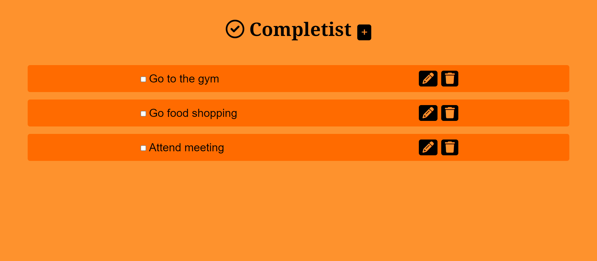
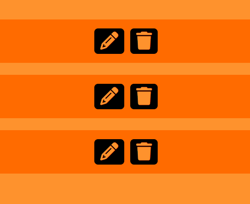
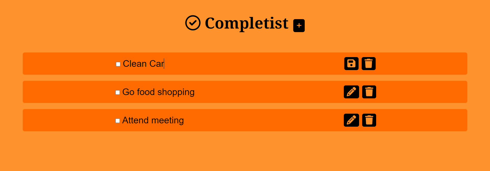
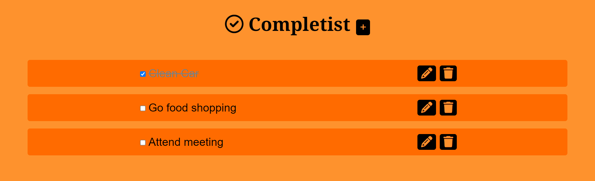
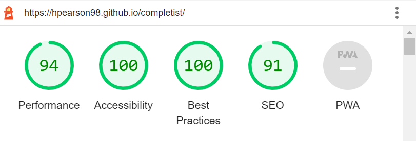

# Completist
Completist is an interactive Web Application that uses HTML, CSS and JavaScript. The Web Application functions as a task organiser where users can log tasks, edit logged tasks and check and delete logged tasks. Completist was built to be responsive and be easily usable on a wide range of platforms, from desktop to mobile.

# User Experience

## Design
* **Colour Scheme**
    * I used a lighter shade of Orange for the background and a darker shade of Orange for the div that holds each task to give a slight contrast between each task.
* **Typography**
    * Noto Serif is used as the font for the main logo, with serif as a fallback font if Noto Serif fails to load. I used this font as it stands out from the rest of the main body creates a clean contrast.
    * Inter is used as the font used for the main body, with sans-serif as a fallback font if Inter fails to load. This font is used because it is very clean and simple which makes it easy to understand and use.
# Features
## Main Logo
* The Main Logo uses the Noto Serif with a bold font weight to create a strong impression to the user. An icon is also used in the main logo which visually enhances the Logo.
    
    
## Add Task Button
*  The Add Task Button is located next to the Main Logo and when clicked, reveals the Add Task Form.
This button helps to keep the user's screen free from clutter, so that the the Add Task Form only appears when the user wants to actually add a task.

    
## Add Task Form
* The Add Task Form features a very clean and minimal design that makes it easy for the user to input their task and confirm it.


## Task Display Area
* The Task Display Area clearly separates each task and makes it easy for the user to distinguish between each task.

    
## Delete Task Button
* The Delete Button allows the user to remove any task they have added. The button contains a trash can, giving a clear visual indication that the button is used to remove a task.

    
## Edit Task Button
* The Edit Task Button allows the user to edit tasks at the click of button. When the button is clicked, the task text is selected and the user is able to edit their task. The content of the button is also changed from the edit icon, to the save icon, giving the user indication to click the button again to save their changes. Once the Save Button is clicked, the text is locked in and the content of the button is changed back to the edit icon so the user may edit again if they please.

    
## Task Checkbox
* The Task Checkbox is interactive so that when the user checks it, the task is crossed off, making it easy for the user to keep track of their tasks.

    
# Technologies Used
## Languages Used
* [HTML5](https://en.wikipedia.org/wiki/HTML5)
* [CSS3](https://en.wikipedia.org/wiki/CSS)
* [JavaScript](https://en.wikipedia.org/wiki/JavaScript)
## Programes and Libraries Used
* [Google Fonts](https://fonts.google.com/)
    * Google fonts was used to to import the Noto Serif and Inter fonts used throughout the Web Application.
* [Font Awesome](https://fontawesome.com/icons)
    * The Font Awesome script was used to implement all the icons used throughout this Web Application.
* [Hover.css](https://ianlunn.github.io/Hover/)
    * Hover.css was used on the buttons to give a visual indication to the user that the button is being targeted.
* [Git](https://git-scm.com/)            
    * Git was used for version control by using the Gitpod terminal to regularly commit to Git and push to Github.
* [Github](https://github.com/)
    * Github was used to store the project's code once it was pushed from Git.
# Testing
## Code Validation
* [W3S Markup Validator](https://validator.w3.org/#validate_by_input)
    * The W3S Markup Validator was used to ensure the HTML code was free of any syntax errors.
* [W3S CSS Validator](https://jigsaw.w3.org/css-validator/#validate_by_input)
    * The W3S CSS Validator was used to ensure the CSS code was free of any syntax errors.
* [JSHint Validator](https://jshint.com/)
    * No errors were found when passing the JavaScript through the official JSHint Validator.
    * The following metrics were returned:
    * There are 5 functions in this file.
    * Function with the largest signature take 1 arguments, while the median is 1.
    * Largest function has 32 statements in it, while the median is 5.
    * The most complex function has a cyclomatic complexity value of 3 while the median is 1.
* Accessibility
    * I have confirmed that the fonts and colours chosen are easy to understand and the use of aria labels makes the Web Application accessible by running it through lighthouse in devtools.

## Further Testing
## Known Bugs

# Deployment
## Github Pages
The project was deployed to Github Pages using the following steps.

1. Log into [Github](https://github.com/) and locate the Github Repository.
2. At the top of the Repository, open the "Settings" tab.
3. On the "Settings" tab, open the "Pages" section.
4. On the "Branch" section, set the branch from "None" to "Main".
5. The page will automatically refresh.
6. Scroll back down through the page to locate the now published site link in the "GitHub Pages" section.

## Forking the Github Repository
By Forking the Github Repository we create a copy of the original Repository that we can use to view and make changes. This can be done using the following steps.

1. Log in to GitHub and locate the GitHub Repository.
2. In the top-right corner of the Repository locate the "Fork" Button.
3. Once clicked on, you should have a copy of the original repository in your GitHub account.

## Making a Local Clone
1. Log into [Github](https://github.com/) and locate the Github Repository.
2. Click on the green "Code" button.
3. To clone the repository using HTTPS, under "Clone with HTTPS", copy the link.
4. Open in Git Bash
5. Change the current working directory to the location where you want the cloned directory to be made.
6. Type `git clone`, and then paste the URL you copied in Step 3.
```
$ git clone https://github.com/YOUR-USERNAME/YOUR-REPOSITORY
```
7. Press Enter. Your local clone will be created.

```
$ git clone https://github.com/YOUR-USERNAME/YOUR-REPOSITORY
> Cloning into `CI-Clone`...
> remote: Counting objects: 10, done.
> remote: Compressing objects: 100% (8/8), done.
> remove: Total 10 (delta 1), reused 10 (delta 1)
> Unpacking objects: 100% (10/10), done.
```

Click [Here](https://help.github.com/en/github/creating-cloning-and-archiving-repositories/cloning-a-repository#cloning-a-repository-to-github-desktop) to retrieve pictures for some of the buttons and more detailed explanations of the above process.

# Credits
## Code
* The following code is credited to the Code Institue Tutor Support team:
    ```
    deleteButton.addEventListener('click', function(event) {
            event.target.parentElement.remove();
    ```
## Content
I used the following [YouTube](https://www.youtube.com/) tutorial for inspiration (none of my code was taken directly from these tutorials).
* [CodeDuck](https://www.youtube.com/watch?v=-pRg_daFjfk&t=377s)
* [Tyler Potts](https://www.youtube.com/watch?v=MkESyVB4oUw&t=343s)

# Acknowledgements
* I would like to thank my Mentor, Jack Wachira for their quality and continuous feedback.
* I would like to thank Tutor Support for their assistance.


            
